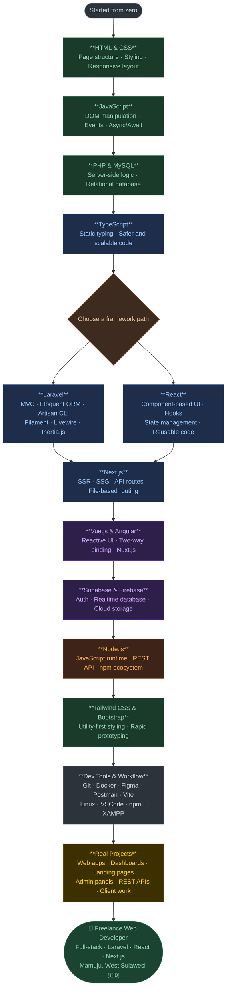

<div align="">

# Royan Dixix

**Freelance Web Developer** — Mamuju, West Sulawesi 🇮🇩

`Laravel` · `React` · `Next.js` · `Supabase` · `TypeScript`

<br/>

<a href="https://github.com/royandixi">
  
</a>
&nbsp;
<a href="https://github.com/royandixi?tab=followers">
  
</a>
&nbsp;
<a href="https://github.com/royandixi?tab=repositories">
  
</a>

</div>

---

## 👨‍💻 About Me

```java
public class Profile {
    String  name     = "Royan Dixix";
    String  role     = "Freelance Web Developer";
    String  location = "Mamuju, West Sulawesi 🇮🇩";
    String[] frontend = {"React", "Next.js", "Vue.js", "Angular", "Tailwind CSS", "TypeScript"};
    String[] backend  = {"Laravel", "Node.js", "Supabase", "Firebase"};
    String[] tools    = {"Git", "Docker", "Figma", "Postman", "Linux"};
    String[] database = {"MySQL", "Supabase", "Firebase"};
    boolean  available = true;
}
```

---

## 🗺️ My Learning Journey

> From zero to full-stack — here's how I got here.



---

<div align="center">
  <sub>crafting scalable web experiences · clean code, real products.</sub>
</div>
