<div align="">

Royan Dixix

Full-Stack Web Developer and Software Enginer

Mamuju, West Sulawesi — Indonesia &nbsp;|&nbsp; Open to Remote Work

<br/>

`Laravel` &nbsp;·&nbsp; `React` &nbsp;·&nbsp; `Next.js` &nbsp;·&nbsp; `TypeScript` &nbsp;·&nbsp; `Supabase` &nbsp;·&nbsp; `Vue.js` &nbsp;·&nbsp; `Node.js` &nbsp;·&nbsp; `Docker`

<br/>

<a href="https://github.com/royandixi">
  
</a>
&nbsp;
<a href="https://github.com/royandixi?tab=followers">
  
</a>
&nbsp;
<a href="https://github.com/royandixi?tab=repositories">
  
</a>
&nbsp;


</div>

---

About Me

```java
public class Profile {
    String  name      = "Royan Dixix";
    String  role      = "Freelance Full-Stack Web Developer";
    String  location  = "Mamuju, West Sulawesi, Indonesia";
    String[] frontend = {"React", "Next.js", "Vue.js", "Angular", "Tailwind CSS", "TypeScript"};
    String[] backend  = {"Laravel", "Node.js", "Supabase", "Firebase"};
    String[] tools    = {"Git", "Docker", "Figma", "Postman", "Linux", "Vite"};
    String[] database = {"MySQL", "Supabase", "Firebase"};
    boolean  available = true; // open to remote work & global opportunities
}
```

---

My Learning Journey

> **10 phases** — from absolute zero to shipping real products for real clients.

```mermaid
flowchart TD
    START([" Started from zero\nCuriosity — no background, no experience"])
    START --> P1

    P1["**Phase 1 — The Foundation**\n─────────────────────────────\nHTML5 · CSS3 · JavaScript ES6+\nDOM manipulation · Async/Await\nResponsive Design · Flexbox · Grid"]
    P1 --> P2

    P2["**Phase 2 — Backend Fundamentals**\n─────────────────────────────\nPHP · MySQL · XAMPP · MAMP\nServer-side logic · CRUD operations\nDatabase design · Query optimization"]
    P2 --> P3

    P3["**Phase 3 — TypeScript & Type Safety**\n─────────────────────────────\nStatic typing · Interfaces · Generics\nType inference · Decorators\nScalable and maintainable code"]
    P3 --> P4

    P4["**Phase 4 — Laravel Ecosystem**\n─────────────────────────────\nMVC architecture · Eloquent ORM\nArtisan CLI · Blade templating\nFilament · Livewire · Inertia.js\nREST API · Authentication · Queues"]
    P4 --> FORK

    FORK{"Which direction to grow?"}
    FORK -->|"Frontend path"| P5A
    FORK -->|"Backend / Runtime"| P5B

    P5A["**Phase 5a — React & Next.js**\n─────────────────────────────\nComponent-based architecture · Hooks\nContext API · Server Components\nSSR · SSG · ISR · API routes\nTailwind CSS · Shadcn UI"]

    P5B["**Phase 5b — Node.js**\n─────────────────────────────\nJavaScript runtime on server\nnpm ecosystem · Express.js\nREST API · Middleware\nReal-time with WebSockets"]

    P5A --> P6
    P5B --> P6

    P6["**Phase 6 — More Frontend Frameworks**\n─────────────────────────────\nVue.js · Nuxt.js · Angular\nReactive UI · Two-way data binding\nOptions API · Composition API\nEnterprise-scale architecture"]
    P6 --> P7

    P7["**Phase 7 — Cloud & Modern Backend**\n─────────────────────────────\nSupabase · Firebase · PostgreSQL\nAuthentication & Authorization\nRealtime database · Cloud storage\nServerless functions · Row Level Security"]
    P7 --> P8

    P8["**Phase 8 — Dev Tools & DevOps Basics**\n─────────────────────────────\nGit & GitHub · Docker · Linux\nFigma · Postman · VSCode\nVite · npm · CI/CD basics\nVersion control best practices"]
    P8 --> P9

    P9["**Phase 9 — UI & Styling Mastery**\n─────────────────────────────\nTailwind CSS · Bootstrap · Mary UI\nReactstrap · CSS animations\nUtility-first · Design systems\nDark mode · Accessibility"]
    P9 --> P10

    P10["**Phase 10 — Real Client Work**\n─────────────────────────────\nWeb applications · Admin dashboards\nLanding pages · E-commerce\nREST APIs · SaaS platforms\nClient communication · Delivery"]
    P10 --> FINAL

    FINAL(["Freelance Full-Stack Developer\n─────────────────────────────\nLaravel · React · Next.js · Supabase · TypeScript\nMamuju, West Sulawesi — Indonesia\nOpen to Remote · Available Now"])

    style START fill:#0d2b22,stroke:#2d6a4f,color:#3fb950
    style FINAL fill:#0d2b22,stroke:#3fb950,color:#3fb950
    style FORK  fill:#2b1a0d,stroke:#995224,color:#f0883e
    style P1    fill:#0d1f17,stroke:#2d6a4f,color:#7ee787
    style P2    fill:#0d1f17,stroke:#2d6a4f,color:#7ee787
    style P3    fill:#0d1b2e,stroke:#1f4d8a,color:#79c0ff
    style P4    fill:#1e120a,stroke:#5a3010,color:#f0883e
    style P5A   fill:#0d1b2e,stroke:#1f4d8a,color:#79c0ff
    style P5B   fill:#0d1b2e,stroke:#1f4d8a,color:#79c0ff
    style P6    fill:#1e1435,stroke:#3a1f6e,color:#d2a8ff
    style P7    fill:#1e1435,stroke:#3a1f6e,color:#d2a8ff
    style P8    fill:#1c1c1c,stroke:#30363d,color:#8b949e
    style P9    fill:#0d1f17,stroke:#2d6a4f,color:#7ee787
    style P10   fill:#2b2200,stroke:#5a4500,color:#e3b341
```


