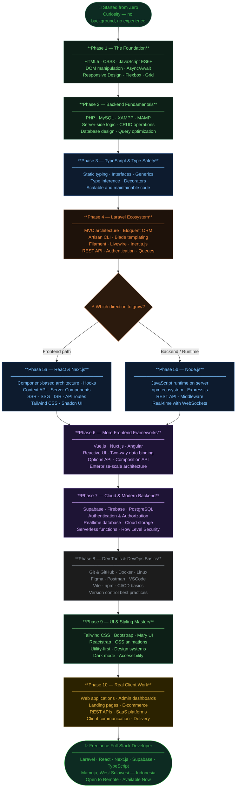

<div align="center">

# 👋 Hey, I'm Royan Dixix

### Full-Stack Web Developer & Software Engineer

📍 Mamuju, West Sulawesi — Indonesia &nbsp;·&nbsp; 🌐 Open to Remote Work

<br/>

[](https://github.com/royandixi)
&nbsp;
[](https://github.com/royandixi?tab=followers)
&nbsp;
[](https://github.com/royandixi?tab=repositories)
&nbsp;


</div>

---

## 🧑‍💻 About Me

```java
public class Profile {
    String   name      = "Royan Dixix";
    String   role      = "Freelance Full-Stack Web Developer";
    String   location  = "Mamuju, West Sulawesi, Indonesia";
    String[] frontend  = {"React", "Next.js", "Vue.js", "Angular", "Tailwind CSS", "TypeScript"};
    String[] backend   = {"Laravel", "Node.js", "Supabase", "Firebase"};
    String[] tools     = {"Git", "Docker", "Figma", "Postman", "Linux", "Vite"};
    String[] database  = {"MySQL", "PostgreSQL", "Supabase", "Firebase"};
    boolean  available = true; // open to remote work & global opportunities
}
```

---

## 🛠️ Tech Stack

<div align="center">

### Frontend


### Backend


### Cloud & Database


### Tools & DevOps


</div>

---

## 🗺️ My Learning Journey

> **10 phases** — from absolute zero to shipping real products for real clients.


```mermaid
flowchart TD
    START([" 🚀 Started from Zero\nCuriosity — no background, no experience"])
    START --> P1

    P1["**Phase 1 — The Foundation**\n─────────────────────────────\nHTML5 · CSS3 · JavaScript ES6+\nDOM manipulation · Async/Await\nResponsive Design · Flexbox · Grid"]
    P1 --> P2

    P2["**Phase 2 — Backend Fundamentals**\n─────────────────────────────\nPHP · MySQL · XAMPP · MAMP\nServer-side logic · CRUD operations\nDatabase design · Query optimization"]
    P2 --> P3

    P3["**Phase 3 — TypeScript & Type Safety**\n─────────────────────────────\nStatic typing · Interfaces · Generics\nType inference · Decorators\nScalable and maintainable code"]
    P3 --> P4

    P4["**Phase 4 — Laravel Ecosystem**\n─────────────────────────────\nMVC architecture · Eloquent ORM\nArtisan CLI · Blade templating\nFilament · Livewire · Inertia.js\nREST API · Authentication · Queues"]
    P4 --> FORK

    FORK{"⚡ Which direction to grow?"}
    FORK -->|"Frontend path"| P5A
    FORK -->|"Backend / Runtime"| P5B

    P5A["**Phase 5a — React & Next.js**\n─────────────────────────────\nComponent-based architecture · Hooks\nContext API · Server Components\nSSR · SSG · ISR · API routes\nTailwind CSS · Shadcn UI"]

    P5B["**Phase 5b — Node.js**\n─────────────────────────────\nJavaScript runtime on server\nnpm ecosystem · Express.js\nREST API · Middleware\nReal-time with WebSockets"]

    P5A --> P6
    P5B --> P6

    P6["**Phase 6 — More Frontend Frameworks**\n─────────────────────────────\nVue.js · Nuxt.js · Angular\nReactive UI · Two-way data binding\nOptions API · Composition API\nEnterprise-scale architecture"]
    P6 --> P7

    P7["**Phase 7 — Cloud & Modern Backend**\n─────────────────────────────\nSupabase · Firebase · PostgreSQL\nAuthentication & Authorization\nRealtime database · Cloud storage\nServerless functions · Row Level Security"]
    P7 --> P8

    P8["**Phase 8 — Dev Tools & DevOps Basics**\n─────────────────────────────\nGit & GitHub · Docker · Linux\nFigma · Postman · VSCode\nVite · npm · CI/CD basics\nVersion control best practices"]
    P8 --> P9

    P9["**Phase 9 — UI & Styling Mastery**\n─────────────────────────────\nTailwind CSS · Bootstrap · Mary UI\nReactstrap · CSS animations\nUtility-first · Design systems\nDark mode · Accessibility"]
    P9 --> P10

    P10["**Phase 10 — Real Client Work**\n─────────────────────────────\nWeb applications · Admin dashboards\nLanding pages · E-commerce\nREST APIs · SaaS platforms\nClient communication · Delivery"]
    P10 --> FINAL

    FINAL(["✨ Freelance Full-Stack Developer\n─────────────────────────────\nLaravel · React · Next.js · Supabase · TypeScript\nMamuju, West Sulawesi — Indonesia\nOpen to Remote · Available Now"])

    style START fill:#0d2b22,stroke:#2d6a4f,color:#3fb950
    style FINAL fill:#0d2b22,stroke:#3fb950,color:#3fb950
    style FORK  fill:#2b1a0d,stroke:#995224,color:#f0883e
    style P1    fill:#0d1f17,stroke:#2d6a4f,color:#7ee787
    style P2    fill:#0d1f17,stroke:#2d6a4f,color:#7ee787
    style P3    fill:#0d1b2e,stroke:#1f4d8a,color:#79c0ff
    style P4    fill:#1e120a,stroke:#5a3010,color:#f0883e
    style P5A   fill:#0d1b2e,stroke:#1f4d8a,color:#79c0ff
    style P5B   fill:#0d1b2e,stroke:#1f4d8a,color:#79c0ff
    style P6    fill:#1e1435,stroke:#3a1f6e,color:#d2a8ff
    style P7    fill:#1e1435,stroke:#3a1f6e,color:#d2a8ff
    style P8    fill:#1c1c1c,stroke:#30363d,color:#8b949e
    style P9    fill:#0d1f17,stroke:#2d6a4f,color:#7ee787
    style P10   fill:#2b2200,stroke:#5a4500,color:#e3b341
```

---

## 📊 GitHub Stats

<div align="center">


</div>

---

## 💼 What I Build

| Type | Examples |
|------|----------|
| 🌐 **Web Applications** | SaaS platforms, internal tools, dashboards |
| 🛒 **E-Commerce** | Full-featured online stores with payment integration |
| 📊 **Admin Dashboards** | Data management, analytics, CRUD interfaces |
| 🔌 **REST APIs** | Scalable backend services & third-party integrations |
| 🎨 **Landing Pages** | High-converting, responsive marketing pages |

---

## 📬 Let's Connect

<div align="center">

[](https://github.com/royandixi)
&nbsp;

&nbsp;


<br/>

> *"From zero to shipping real products — one phase at a time."*

</div>
